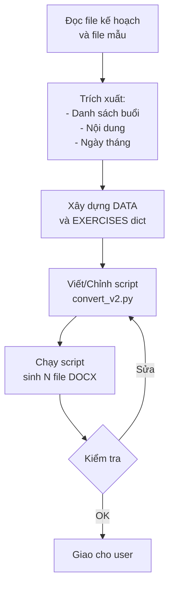

# Skill: Sinh Giáo Án GDTC Tự Động

## Tổng Quan

Skill này hướng dẫn quy trình **tạo bộ giáo án Giáo dục Thể chất** (GDTC) hoàn chỉnh từ:
1. **File kế hoạch** (`.docx` hoặc `.md`) — chứa danh sách buổi tập, nội dung, lịch dạy
2. **File mẫu giáo án** (`.docx` hoặc `.md`) — chuẩn cấu trúc hành chính (TIẾT ÔN TẬP)
3. **Script Python** — sinh hàng loạt file DOCX theo chuẩn mẫu

---

## Quy Trình Thực Hiện (6 Bước)

### Bước 1: Thu thập và Đọc dữ liệu đầu vào

**Hỏi user các thông tin sau (nếu chưa có):**
- File kế hoạch giảng dạy (VD: `KẾ HOẠCH XIN TẬP ĐỘI TUYỂN 25-26.docx`)
- File giáo án mẫu (VD: `TIẾT ÔN TẬP.docx`)
- Thông tin trường, tổ bộ môn, tên giáo viên
- Số lượng buổi cần tạo
- Thời gian bắt đầu - kết thúc
- Lịch tập hàng tuần (VD: chiều thứ 2 và thứ 7)

**Đọc kế hoạch để trích xuất:**
- Bảng nội dung 18 buổi (số buổi, nội dung, ghi chú dụng cụ)
- Danh sách học sinh/VĐV
- Ngày tháng cụ thể từng buổi

**Đọc file mẫu để nắm cấu trúc chuẩn.**

### Bước 2: Xác định Cấu trúc giáo án chuẩn

Mỗi giáo án PHẢI tuân theo cấu trúc chuẩn sau (dựa trên mẫu TIẾT ÔN TẬP):

```
HEADER: Trường / Tổ / GV / Bảng ngày soạn-dạy-tuần-lớp

I. MỤC TIÊU
   1. Về kiến thức (3-4 gạch đầu dòng)
   2. Năng lực
      - Năng lực chung (3 gạch đầu dòng: tự chủ/tự học, giao tiếp/hợp tác, giải quyết vấn đề)
      - Năng lực GDTC (3-4 gạch đầu dòng chuyên môn)
   3. Phẩm chất (4-5 gạch đầu dòng: chăm chỉ, trung thực, kỷ luật, trách nhiệm, tự tin)

II. THIẾT BỊ DẠY HỌC VÀ HỌC LIỆU
   1. Đối với giáo viên (4 gạch đầu dòng)
   2. Đối với học sinh (3 gạch đầu dòng)

III. TIẾN TRÌNH DẠY HỌC (hoặc HUẤN LUYỆN)
   A. HOẠT ĐỘNG KHỞI ĐỘNG (15-20 phút)
      a. Mục tiêu
      b. Nội dung
      c. Sản phẩm
      d. Tổ chức thực hiện
         Bước 1: GV chuyển giao nhiệm vụ học tập
         Bước 2: HS tiếp nhận, thực hiện nhiệm vụ học tập
         Bước 3: Báo cáo kết quả hoạt động, thảo luận
         Bước 4: Đánh giá kết quả thực hiện nhiệm vụ

   B. HOẠT ĐỘNG HÌNH THÀNH KIẾN THỨC VÀ LUYỆN TẬP (90-100 phút)
      a. Mục tiêu
      b. Nội dung
      c. Sản phẩm
      d. Tổ chức thực hiện
         Bước 1: GV chuyển giao nhiệm vụ (bài tập chi tiết theo nhóm)
         Bước 2: HS tiếp nhận, thực hiện
         Bước 3: Báo cáo kết quả (+ bảng lỗi sai & khắc phục)
         Bước 4: Đánh giá kết quả

   C. HOẠT ĐỘNG VẬN DỤNG (10-15 phút)
      a. Mục tiêu
      b. Nội dung
      c. Sản phẩm
      d. Tổ chức thực hiện (4 bước như trên)

   D. HOẠT ĐỘNG THƯ GIÃN VÀ HỒI PHỤC (10-15 phút)
      a. Mục tiêu
      b. Nội dung
      c. Sản phẩm
      d. Tổ chức thực hiện (4 bước như trên)

HƯỚNG DẪN VỀ NHÀ (5-7 gạch đầu dòng)
```

> [!IMPORTANT]
> **Quy tắc bắt buộc:**
> - Mỗi hoạt động A/B/C/D đều có **4 mục con**: a (Mục tiêu), b (Nội dung), c (Sản phẩm), d (Tổ chức thực hiện)
> - Trong phần "d. Tổ chức thực hiện" luôn có **4 bước**: Bước 1 → Bước 2 → Bước 3 → Bước 4
> - Phần B (nội dung chính) PHẢI có **bảng lỗi sai thường mắc** và **biện pháp khắc phục** (bảng 2 cột)
> - Mỗi giáo án hoàn chỉnh khoảng **7-8 trang** khi in DOCX

### Bước 3: Chuẩn bị dữ liệu nội dung cho từng buổi

Tạo danh sách `DATA` gồm các tuple cho mỗi buổi:

```python
DATA = [
    (số_buổi, tuần, "ngày_dạy", "tiêu_đề_nội_dung", "content_key"),
    # VD:
    (1, 1, "13/12/2025", "Thể lực (chung)", "the_luc_chung"),
    (2, 1, "15/12/2025", "Thể lực (chung, chuyên môn)", "the_luc_cm"),
    ...
]
```

Tạo dict `EXERCISES` với nội dung bài tập chi tiết theo từng `content_key`:

```python
EXERCISES = {
    "content_key": {
        "nhom1": ("Tên nhóm 1", ["Bài tập 1", "Bài tập 2", ...]),
        "nhom2": ("Tên nhóm 2", ["Bài tập 1", "Bài tập 2", ...]),
        "nhom3": ("Tên nhóm 3", ["Bài tập 1", "Bài tập 2", ...]),
        "nhom4": ("Tên nhóm 4", ["Bài tập 1", "Bài tập 2", ...]),
        "errors": [
            ("Lỗi sai thường gặp", "Biện pháp khắc phục"),
            ...
        ],
    }
}
```

> [!TIP]
> Nội dung bài tập PHẢI khác nhau giữa các buổi để tăng tính chuyên biệt. Nếu `content_key` chưa có trong `EXERCISES`, dùng nội dung mặc định (`EXERCISES["the_luc_chung"]`) làm fallback.

### Bước 4: Viết script Python tạo DOCX

Script sử dụng thư viện `python-docx` để tạo file DOCX chuyên nghiệp.

**Các hàm cần có:**

| Hàm | Mô tả |
|-----|-------|
| `add_para(doc, text, bold, italic, size, align, ...)` | Thêm paragraph với format |
| `add_bullet(doc, text, bold, italic, ...)` | Thêm bullet list |
| `add_mixed_para(doc, parts, ...)` | Paragraph nhiều format (bold + italic lẫn nhau) |
| `create_error_table(doc, errors)` | Tạo bảng lỗi sai 2 cột |
| `create_giao_an(num, tuan, ngay_day, title, content_key)` | Hàm chính sinh 1 giáo án |
| `main()` | Loop qua DATA, gọi create_giao_an cho từng buổi |

**Cấu hình document:**
```python
# Font mặc định
style.font.name = 'Times New Roman'
style.font.size = Pt(13)

# Margin
section.top_margin = Cm(2)
section.bottom_margin = Cm(2)
section.left_margin = Cm(2)
section.right_margin = Cm(2)
```

**Cấu trúc hàm `create_giao_an`** (theo thứ tự):
1. Khởi tạo Document, set font/margin
2. Tạo HEADER (trường, tổ, GV, bảng ngày)
3. Tạo tiêu đề giáo án (centered, bold, size 14)
4. Tạo phần I. MỤC TIÊU
5. Tạo phần II. THIẾT BỊ
6. Tạo phần III. TIẾN TRÌNH (A → B → C → D)
   - Phần A: Khởi động (chung + chuyên môn)
   - Phần B: Nội dung chính (bài tập theo nhóm + bảng lỗi sai)
   - Phần C: Vận dụng
   - Phần D: Thư giãn, hồi phục
7. Tạo phần HƯỚNG DẪN VỀ NHÀ
8. Lưu file DOCX

### Bước 5: Chạy script và kiểm tra

```bash
# Cài đặt thư viện nếu chưa có
pip install python-docx

# Chạy script
python convert_v2.py
```

**Kiểm tra:**
- [ ] Đủ số lượng file DOCX đã tạo
- [ ] Mở thử 2-3 file DOCX bằng Word, kiểm tra format
- [ ] Kiểm tra độ dài (~7-8 trang)
- [ ] Kiểm tra bảng lỗi sai có hiển thị đúng không
- [ ] Kiểm tra font Times New Roman, size 13pt

### Bước 6: Tinh chỉnh và hoàn thiện

- Nếu user yêu cầu chỉnh sửa nội dung cụ thể → sửa trong dict `EXERCISES`
- Nếu cần thêm nội dung đặc thù cho buổi nào → thêm key mới vào `EXERCISES`
- Nếu cần đổi thông tin trường/GV → sửa trong phần HEADER của `create_giao_an`

---

## Cây Thư Mục Tham Chiếu

```
c:\Users\admin\Desktop\giao an\
├── KẾ HOẠCH XIN TẬP ĐỘI TUYỂN 25-26.docx  ← File kế hoạch gốc
├── TIẾT ÔN TẬP.docx                         ← File mẫu chuẩn cấu trúc
├── ke_hoach.md                               ← Kế hoạch dạng markdown (đã chuyển)
├── tiet_on_tap.md                            ← Mẫu giáo án dạng markdown (đã chuyển)
├── generate_giao_an.py                       ← Script v1: sinh 18 file .md từ template
├── convert_md_to_docx.py                     ← Script chuyển .md → .docx
├── convert_v2.py                             ← Script v2: sinh trực tiếp .docx (khuyên dùng)
└── Giao an doi tuyen dien kinh/              ← Thư mục output
    ├── Giao_an_buoi_01.md / .docx
    ├── Giao_an_buoi_02.md / .docx
    └── ... (18 cặp file)
```

## Quy Trình Nhanh (Tóm Tắt)



## Lưu Ý Quan Trọng

> [!CAUTION]
> - **KHÔNG** viết tay từng giáo án — luôn dùng script để đảm bảo nhất quán
> - Font **PHẢI** là Times New Roman 13pt (chuẩn công văn VN)
> - Bảng lỗi sai PHẢI dùng `doc.add_table()` với style `Table Grid`
> - Ngày soạn thường cố định (ngày bắt đầu kế hoạch), ngày dạy thay đổi theo lịch
> - Nội dung bài tập phần B PHẢI được chia theo **4 nhóm chuyên môn**

> [!NOTE]
> Script `convert_v2.py` là phiên bản **khuyên dùng** vì:
> - Tạo trực tiếp DOCX (không cần qua bước MD trung gian)
> - Format chính xác hơn (indent, bold/italic, table)
> - Dễ mở rộng nội dung bằng cách thêm key vào `EXERCISES`

## Các Tình Huống Mở Rộng

### Tạo giáo án cho môn khác (không phải Điền kinh)
1. Đổi nội dung `EXERCISES` sang nội dung môn mới
2. Đổi phần khởi động chuyên môn trong phần A
3. Giữ nguyên cấu trúc A/B/C/D + 4 bước

### Tạo giáo án cho dạy trên lớp (không phải đội tuyển)
1. Đổi header: "Lớp" thay vì "Đội tuyển"
2. Đổi "III. TIẾN TRÌNH HUẤN LUYỆN" → "III. TIẾN TRÌNH DẠY HỌC"
3. Thời lượng phần B: 25-30 phút (thay vì 90-100 phút)
4. Thêm phần "Năng lực số" nếu theo chương trình 2018

### Tùy chỉnh nội dung bài tập
- Mỗi key trong `EXERCISES` có 4 nhóm + 1 danh sách lỗi sai
- Thêm key mới = thêm 1 bộ bài tập riêng cho 1 buổi cụ thể
- Nếu không có key → tự động fallback về `"the_luc_chung"`
