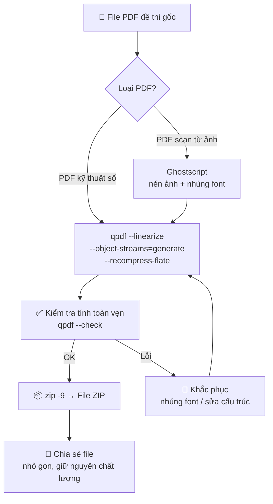

# Xử Lý & Tối Ưu PDF Công Thức Toán

## Tổng quan

Skill này hướng dẫn cách **tối ưu kích thước file PDF** chứa đề thi Toán (có công thức, hình vẽ) mà **giữ nguyên 100% chất lượng hiển thị**. Phương pháp sử dụng kỹ thuật nén **lossless** (không mất dữ liệu) thông qua công cụ dòng lệnh chuyên dụng.

### Vấn đề cần giải quyết

- File PDF đề thi Toán thường chứa nhiều **công thức toán học**, **hình vẽ hình học**, **đồ thị** → kích thước file lớn.
- Khi có **nhiều mã đề** (101, 102, 103...), tổng dung lượng rất lớn, khó chia sẻ qua email/Zalo.
- Cần nén mà **không được phép** làm mờ công thức hay hỏng font chữ toán học.

---

## Yêu cầu hệ thống

### Công cụ cần cài đặt

| Công cụ | Mục đích | Cài đặt |
|---------|----------|---------|
| **qpdf** | Tối ưu cấu trúc PDF (lossless) | `sudo apt install qpdf` (Linux) / `brew install qpdf` (macOS) / [Tải về cho Windows](https://github.com/qpdf/qpdf/releases) |
| **zip** hoặc **7z** | Đóng gói file đã tối ưu | Có sẵn trên hầu hết hệ điều hành |
| **pdfcpu** *(tùy chọn)* | Công cụ thay thế cho qpdf | `go install github.com/pdfcpu/pdfcpu/cmd/pdfcpu@latest` |

### Môi trường chạy script

- **Linux / macOS**: Chạy trực tiếp trên Terminal.
- **Windows**: Sử dụng **WSL** (Windows Subsystem for Linux) hoặc **Git Bash**.

---

## Bộ Skill Kỹ thuật cần nắm

### 1. Sử dụng công cụ dòng lệnh (CLI)

Thành thạo **qpdf** hoặc **pdfcpu** — hai công cụ mạnh nhất để tối ưu cấu trúc PDF mà không làm thay đổi nội dung hiển thị.

### 2. Hiểu về PDF Object Streams

Biết cách **gộp các đối tượng nhỏ lẻ** trong PDF thành các "luồng" (streams) để nén hiệu quả hơn. Đây là nguyên lý cốt lõi giúp giảm kích thước mà không ảnh hưởng chất lượng.

### 3. Kỹ năng Batch Processing (Xử lý hàng loạt)

Viết script đơn giản (**Bash** hoặc **Python**) để:
- Quét toàn bộ thư mục chứa đề thi.
- Nén từng file PDF.
- Gom vào một tệp ZIP duy nhất.

### 4. Kiểm tra tính toàn vẹn (Validation)

Sau khi nén, **bắt buộc** phải kiểm tra:
- Font chữ công thức toán có bị lỗi hiển thị không.
- Hình vẽ, đồ thị có còn rõ nét không.
- File có mở được bình thường trên nhiều trình đọc PDF không.

---

## Quy trình thực hiện (Workflow)

> [!IMPORTANT]
> Phương pháp chính sử dụng **qpdf** — công cụ phổ biến và cực kỳ ổn định cho đề thi Toán có công thức.

### Bước 1: Tối ưu cấu trúc PDF (Lossless)

Lệnh này thực hiện 3 việc cùng lúc:
- **Linearize**: Tuyến tính hóa file → mở nhanh hơn.
- **Object Streams**: Gộp các đối tượng nhỏ → nén hiệu quả hơn.
- **Recompress Flate**: Nén lại dữ liệu với thuật toán tối ưu hơn.

```bash
qpdf --linearize --object-streams=generate --recompress-flate "Mã đề 101.pdf" "Ma_de_101_fixed.pdf"
```

**Giải thích các tham số:**

| Tham số | Ý nghĩa |
|---------|---------|
| `--linearize` | Sắp xếp lại cấu trúc PDF để mở nhanh hơn (đặc biệt trên web) |
| `--object-streams=generate` | Gộp các đối tượng nhỏ lẻ thành stream → giảm kích thước |
| `--recompress-flate` | Nén lại dữ liệu hiện có với thuật toán Flate tối ưu hơn |

> [!NOTE]
> Chất lượng hình vẽ và công thức được giữ nguyên **100%** vì đây là nén **lossless** (không mất dữ liệu).

### Bước 2: Nén ZIP

Sau khi đã có các file đã tối ưu, đóng gói bằng lệnh `zip` với **mức nén cao nhất** (`-9`):

```bash
zip -9 De_Thi_Toan_10.zip "Ma_de_101_fixed.pdf"
```

Nếu có nhiều file:

```bash
zip -9 De_Thi_Toan_10.zip Ma_de_*_fixed.pdf
```

### Bước 3: Kiểm tra kết quả

```bash
# So sánh kích thước trước và sau
ls -lh "Mã đề 101.pdf" "Ma_de_101_fixed.pdf"

# Kiểm tra file PDF có hợp lệ không
qpdf --check "Ma_de_101_fixed.pdf"
```

---

## Script xử lý hàng loạt

> [!TIP]
> Sử dụng script này khi bạn có **nhiều mã đề** (101, 102, 103...) trong cùng một thư mục.

### Script Bash (Linux/macOS/WSL)

```bash
#!/bin/bash

# ============================================
# Script tối ưu hàng loạt PDF đề thi Toán
# ============================================

# Tạo thư mục tạm để chứa file đã nén
mkdir -p optimized_files

# Đếm số file
total=$(ls -1 *.pdf 2>/dev/null | wc -l)
count=0

# Duyệt qua tất cả file PDF trong thư mục hiện tại
for f in *.pdf; do
    count=$((count + 1))
    echo "[$count/$total] Đang tối ưu: $f"
    qpdf --linearize --object-streams=generate --recompress-flate "$f" "optimized_files/$f"

    # Kiểm tra tính toàn vẹn
    if qpdf --check "optimized_files/$f" > /dev/null 2>&1; then
        echo "  ✅ OK"
    else
        echo "  ❌ LỖI: File $f có thể bị hỏng sau khi tối ưu!"
    fi
done

# Nén tất cả vào file ZIP với mức nén cao nhất
zip -j -9 Danh_Sach_De_Thi.zip optimized_files/*.pdf

# Hiển thị kết quả
echo ""
echo "============================================"
echo "Hoàn thành! File của bạn là: Danh_Sach_De_Thi.zip"
echo "============================================"

# Hiển thị so sánh kích thước
original_size=$(du -sh *.pdf | tail -1 | cut -f1)
optimized_size=$(du -sh Danh_Sach_De_Thi.zip | cut -f1)
echo "Kích thước gốc (tổng):    $original_size"
echo "Kích thước sau nén (ZIP):  $optimized_size"

# Xóa thư mục tạm (bỏ comment dòng dưới nếu muốn tự động xóa)
# rm -rf optimized_files
```

### Script Python (Đa nền tảng)

```python
import subprocess
import os
import zipfile
from pathlib import Path

def optimize_pdf(input_path: str, output_path: str) -> bool:
    """Tối ưu một file PDF bằng qpdf."""
    try:
        subprocess.run([
            "qpdf",
            "--linearize",
            "--object-streams=generate",
            "--recompress-flate",
            input_path,
            output_path
        ], check=True, capture_output=True)
        return True
    except subprocess.CalledProcessError as e:
        print(f"  ❌ Lỗi khi xử lý {input_path}: {e.stderr.decode()}")
        return False

def validate_pdf(pdf_path: str) -> bool:
    """Kiểm tra tính toàn vẹn của file PDF."""
    try:
        result = subprocess.run(
            ["qpdf", "--check", pdf_path],
            capture_output=True
        )
        return result.returncode == 0
    except FileNotFoundError:
        print("⚠️ Không tìm thấy qpdf. Hãy cài đặt trước.")
        return False

def batch_optimize(source_dir: str, output_zip: str = "Danh_Sach_De_Thi.zip"):
    """Tối ưu hàng loạt PDF và đóng gói ZIP."""
    source = Path(source_dir)
    pdf_files = sorted(source.glob("*.pdf"))

    if not pdf_files:
        print("Không tìm thấy file PDF nào!")
        return

    # Tạo thư mục tạm
    optimized_dir = source / "optimized_files"
    optimized_dir.mkdir(exist_ok=True)

    print(f"Tìm thấy {len(pdf_files)} file PDF")
    print("=" * 50)

    success_count = 0
    for i, pdf in enumerate(pdf_files, 1):
        output_path = optimized_dir / pdf.name
        print(f"[{i}/{len(pdf_files)}] Đang tối ưu: {pdf.name}")

        if optimize_pdf(str(pdf), str(output_path)):
            if validate_pdf(str(output_path)):
                print(f"  ✅ OK — {pdf.stat().st_size // 1024}KB → {output_path.stat().st_size // 1024}KB")
                success_count += 1
            else:
                print(f"  ⚠️ File có thể bị lỗi hiển thị!")

    # Đóng gói ZIP
    zip_path = source / output_zip
    with zipfile.ZipFile(zip_path, 'w', zipfile.ZIP_DEFLATED, compresslevel=9) as zf:
        for pdf in optimized_dir.glob("*.pdf"):
            zf.write(pdf, pdf.name)

    print("=" * 50)
    print(f"✅ Hoàn thành! {success_count}/{len(pdf_files)} file thành công")
    print(f"📦 File ZIP: {zip_path}")
    print(f"📏 Kích thước ZIP: {zip_path.stat().st_size // 1024}KB")

if __name__ == "__main__":
    import sys
    directory = sys.argv[1] if len(sys.argv) > 1 else "."
    batch_optimize(directory)
```

**Cách sử dụng:**

```bash
python optimize_pdf.py /đường/dẫn/tới/thư/mục/đề/thi
```

---

## Xử lý sự cố thường gặp

### Font công thức bị lỗi sau khi nén

> [!CAUTION]
> Nếu công thức toán bị hiển thị sai (ký tự lạ, mất dấu), nguyên nhân có thể là file PDF gốc **không nhúng font** (embedded font).

**Cách khắc phục:**

```bash
# Kiểm tra font nhúng trong PDF
qpdf --show-pages --with-images "file.pdf"

# Nếu thiếu font, dùng Ghostscript để nhúng font trước khi tối ưu
gs -dNOPAUSE -dBATCH -sDEVICE=pdfwrite \
   -dEmbedAllFonts=true \
   -sOutputFile="file_embedded.pdf" "file.pdf"
```

### File PDF quá lớn do chứa ảnh scan

Nếu đề thi được **scan** (không phải PDF kỹ thuật số), cần thêm bước nén ảnh:

```bash
# Nén ảnh trong PDF (lossy - có giảm chất lượng nhẹ)
gs -dNOPAUSE -dBATCH -sDEVICE=pdfwrite \
   -dCompatibilityLevel=1.4 \
   -dPDFSETTINGS=/ebook \
   -sOutputFile="file_compressed.pdf" "file.pdf"
```

> [!WARNING]
> Tham số `-dPDFSETTINGS=/ebook` sẽ giảm chất lượng ảnh xuống 150 DPI. Với đề thi Toán có công thức nhỏ, nên dùng `/prepress` (300 DPI) để giữ độ rõ nét.

### qpdf không nhận diện được file

```bash
# Sửa file PDF bị lỗi cấu trúc
qpdf --replace-input "file_loi.pdf"
```

---

## Mẹo nâng cao

### 1. Kết hợp nhiều mã đề thành một file PDF

```bash
qpdf --empty --pages Ma_de_*.pdf -- Tat_Ca_De_Thi.pdf
```

### 2. Tách một mã đề ra từ file tổng hợp

```bash
# Tách trang 1-4 (giả sử mỗi đề thi có 4 trang)
qpdf "Tat_Ca_De_Thi.pdf" --pages . 1-4 -- "Ma_de_101.pdf"
```

### 3. Thêm watermark hoặc header

```bash
# Thêm watermark từ file PDF khác
qpdf "De_thi.pdf" --overlay "watermark.pdf" -- "De_thi_watermarked.pdf"
```

### 4. Bảo vệ file bằng mật khẩu

```bash
qpdf --encrypt "matkhau_mo" "matkhau_admin" 256 -- "De_thi.pdf" "De_thi_baomat.pdf"
```

---

## Tóm tắt nhanh



| Skill | Mô tả | Mức độ |
|-------|--------|--------|
| Cài đặt & sử dụng **qpdf** | Công cụ chính để tối ưu PDF | ⭐⭐ Cơ bản |
| Cơ bản về **Terminal/CLI** | Để chạy lệnh và script | ⭐⭐ Cơ bản |
| Sử dụng **zip** hoặc **7z** | Đóng gói tệp tin chuyên nghiệp | ⭐ Dễ |
| Viết **script Bash/Python** | Xử lý hàng loạt tự động | ⭐⭐⭐ Trung bình |
| Hiểu **PDF Object Streams** | Nguyên lý nén lossless | ⭐⭐⭐ Trung bình |
| Kiểm tra **font nhúng** | Đảm bảo công thức hiển thị đúng | ⭐⭐⭐ Trung bình |
